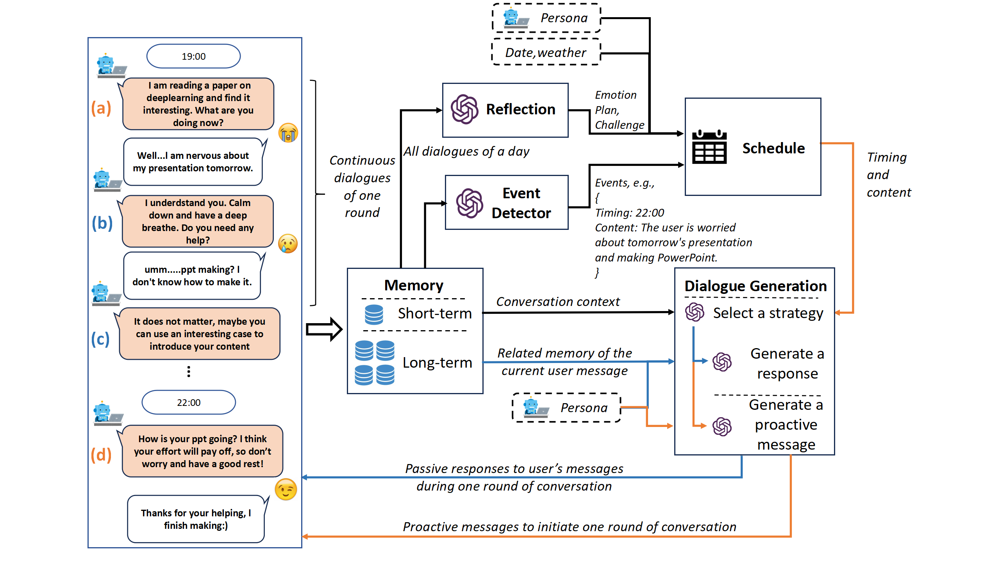

## ComPeer: A Generative Conversational Agent in Proactive Peer Support

The architecture of the agent in the submission of UIST' 2024: **ComPeer: A Generative Conversational Agent in Proactive Peer Support**.

ComPeer can learn about users from the dialogues, and plan the timing and content of proactive messages, to offer proactive peer support.

Please click [here](https://arxiv.org/pdf/2407.18064) to read our paper!



*There are some words minors in our camera ready version. We have made the corrections in the provided link.*

### Quick Start

#### 1. Install requirements

```shell
git clone https://github.com/liutj9/ComPeer.git
cd ComPeer
conda create --n ComPeer python==3.9
conda activate ComPeer
pip install -r requirements.txt
```

#### 2. Set IM bot

ComPeer is deployed on QQ using [go-cqhttp](https://github.com/Mrs4s/go-cqhttp)). Before interacting with the agent, you need to download [QQ](https://im.qq.com/pcqq/index.shtml) and register for a QQ account.

1. Download QQ on your phone/PC and register accounts.

2. Download go-cqhttp at their [release page](https://github.com/Mrs4s/go-cqhttp/releases) to the ComPeer. Unzip go-cqhttp in the ComPeer.

   ```shell
   cd ComPeer
   unzip [your_go-cqhttp_file.zip]
   ```

3. For Linux, enter `./go-cqhttp` to start the bot。

   ```shell
   ./go-cqhttp
   ```

4. The first startup will fail. Refer to [config.md](https://github.com/Mrs4s/go-cqhttp/blob/master/docs/config.md) to fill in the generated `config.yaml`. After that, enter `./go-cqhttp` again. The following output means the setup is successful:

   ```shell
   [INFO]: 登录成功
   ```

[Here](https://docs.go-cqhttp.org/guide/quick_start.html#基础教程) is the Chinese document of the go-cqhttp deployment.

#### 3. Initialize Agent setting

1. Fill in your `API_KEY` and `BASE_URL` in `src/settings.py`. 

2. Design the persona of the CA. 

   Fill your CA's prompt in `prompt_en`. You need to provide `persona_{user_id}.txt`, `proactive_{user_id}.txt`, and `schedule_generation_{user_id}.txt`. The prompt format and content can refer to the appendix of [our paper](https://arxiv.org/pdf/2407.18064) or the `prompt_en` files.

3. Fill your user account in `user_states/user_ids.txt`. You can enter multiple QQ accounts to allow ComPeer to interact with different users (but you will also need to provide corresponding prompt files) 

   ```
   123456
   678789
   ...
   ```

​       Then, ensure ComPeer's QQ account to add the users' QQ accounts.

4. run `main.py` in your shell. Now, you can interact with ComPeer on QQ!

   ```shell
   python main.py
   ```

### Repository Description

- `prompt_en`: The prompt of ComPeer.

- `history`: The conversation history stored in long term memory of ComPeer.
- `memory`: The conversation context held by shor term memory of ComPeer.
- `reflection_logs`: The conversation stored by reflection module of ComPeer to reflect each day.
- `schedule`: The each day schedule of ComPeer, managed by schedule module of ComPeer.
- `src`: The aritecture of ComPeer.
- `user_state`: include all user id (QQ account).

### Acknowledgement

This project includes some codes (`src/vectorDB.py`) from the [CyberWaifu](https://github.com/Syan-Lin/CyberWaifu).

Thanks to all the authors, participants in our formative and user study!

### Citation

Please cite the following paper if you reference our work.

```
@article{liu2024compeer,
  title={ComPeer: A Generative Conversational Agent for Proactive Peer Support},
  author={Liu, Tianjian and Zhao, Hongzheng and Liu, Yuheng and Wang, Xingbo and Peng, Zhenhui},
  journal={arXiv preprint arXiv:2407.18064},
  year={2024}
}
```
